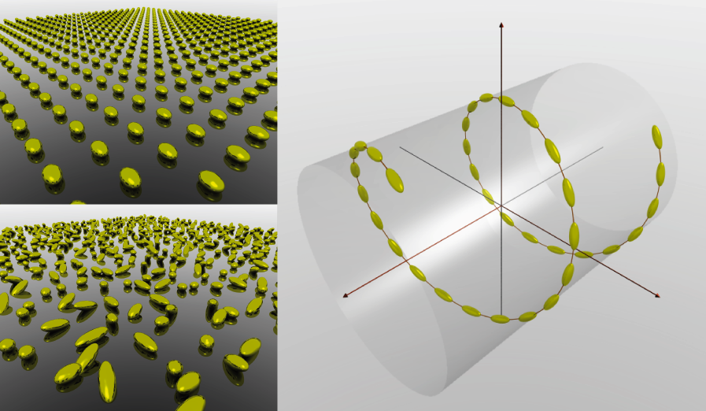

## Coupled-dipole simulations of sparse plasmonic nanoparticle assemblies using the cda package

> Baptiste Auguie <baptiste.auguie@gmail.com>
> v1.3, 2013-01

-----

 

> Ray-tracing rendering of 3D clusters of plasmonic nanoparticles with arbitrary positions, sizes, and orientations.


### Brief description

The [`cda` package](http://cran.r-project.org/web/packages/cda/index.html) implements the coupled-dipole approximation for electromagnetic scattering by sparse collections of subwavelength particles, with a particular focus on plasmonic nanoparticles in the visible regime. The interaction matrix, and the solution of the linear system of coupled-dipole equations are executed in `C++` code for speed; convenient wrapper functions are provided at the `R` level to generate the particle clusters, calculate the extinction, scattering, and absorption of light by particles with linearly and circularly polarised light. Functions are also provided to calculate orientation-averaged circular dichroism, and display clusters of nanoparticles in three dimensions using [OpenGL](http://www.opengl.org/) or [povray](http://www.povray.org/).

### Package installation

`cda` is an [`R`](http://www.r-project.org/) package available on [CRAN](http://cran.r-project.org/); it may be installed directly from the `R` command line,


#### Loading the package and first steps

```r
install.packages("cda")

# load the package
library(cda)

# Introductory document
vignette(package = "cda")

# A few examples
demo(package = "cda")
```

A more complete description, along with some tutorial examples, can be found on the [github project wiki](https://github.com/baptiste/cda/wiki).

--------

### Basic Usage 

In this example we define a dimer of nanorods,  model its optical response to linearly polarised light at fixed incidence, and orientation-averaged optical activity.

```{r load,message=FALSE}
# loading the package
library(cda)
library(rgl) # 3D visualisation
library(ggplot2) # 2D graphs
```
```{r setup,echo=FALSE}
knit_hooks$set(rgl = function(before, options, envir) {
  # if a device was opened before this chunk, close it
  if (before && rgl.cur() > 0) rgl.close()
  hook_rgl(before, options, envir)
})
rgl_annotate = function(){
  axes3d( labels = FALSE, tick = FALSE, edges=c("x", "y", "z") )
axis3d(labels = FALSE, tick = FALSE, 'x',pos=c(NA, 0, 0))
axis3d(labels = FALSE, tick = FALSE, 'y',pos=c(0, NA, 0))
axis3d(labels = FALSE, tick = FALSE, 'z',pos=c(0, 0, NA))
title3d('','','x axis','y axis','z axis')
}
theme_set(theme_minimal())
```

### Manually defining a cluster
```{r cluster, rgl=TRUE,echo=1:6,tidy=FALSE,fig.width=3,fig.height=3,fig.path="basic-"}
# dielectric function
wvl <- seq(400, 900)
gold <- epsAu(wvl)

# define a cluster of particles
cl <- list(r = rbind(c(0, 0, 0),
                      c(0, 0, 200)),
            angles = rbind(c(0, 0, 0),
                           c(pi/4, 0, 0)),
            sizes = rbind(c(40, 20, 20),
                          c(40, 20, 20)))

# visualise
rgl.ellipsoids(cl$r, cl$sizes, cl$angles, col="gold")
rgl.viewpoint( theta = 0, phi = 20, fov = 70, zoom = 1)
rgl_annotate()
```

#### Extinction, absorption, scattering of linearly polarised light at fixed incidence

```{r linear,echo=1:2,tidy=FALSE,fig.path="basic-"}
# calculate extinction spectrum at fixed incidence
linear <- linear_extinction_spectrum(cl, gold)
ggplot(linear, aes(wavelength, value, color=variable)) + geom_path() +
  labs(x="Wavelength /nm", y= expression("Cross-section /"*nm^2), colour = "polarisation")
```

#### Orientation-averaged optical activity

```{r oa,echo=1,tidy=FALSE,fig.path="basic-",fig.width=8}
circular <- circular_dichroism_spectrum(cl, gold)
ggplot(circular, aes(wavelength, value, color=variable)) + 
  facet_grid(type~variable, scales="free") + geom_path()+ guides(colour="none")+
  labs(x="Wavelength /nm", y= expression("Cross-section /"*nm^2))
```

### References

If you find this package useful in your research, please cite one of the following references, as appropriate.

0. Baptiste Auguié. _CDA: Coupled dipole approximation with R and C++._ R package version 1.3, 2012.
1.	B. Auguié, J.L. Alonso-Gómez, A. Guerrero-Martìnez, and L.M. Liz-Marzán. _Fingers crossed: Optical activity of a chiral dimer of plasmonic nanorods._ The Journal of Physical Chemistry Letters, 2, 2011.
2.	A. Guerrero-Martìnez, J.L. Alonso-Gómez, B. Auguié, M. Cid, and L.M. Liz-Marzán. _From individual to collective chirality in metal nanoparticles._ Nano Today, 6 2011.
3.	A. Guerrero-Martìnez, B.Auguié, J.L. Alonso-Gómez, Z.Džolić, S. Gómez-Graña, M. Žinić, M.M. Cid, and L.M. Liz-Marzán. _Intense optical activity from three-dimensional chiral ordering of plasmonic nanoantennas._ Angewandte Chemie International Edition, 50, 2011.
4.	B. Auguié and W.L. Barnes. _Diffractive coupling in gold nanoparticle arrays and the effect of disorder._ Opt. Lett., 34, 2009.
5.	B. Auguié and W.L. Barnes. _Collective resonances in gold nanoparticle arrays._ 101, 2008.

